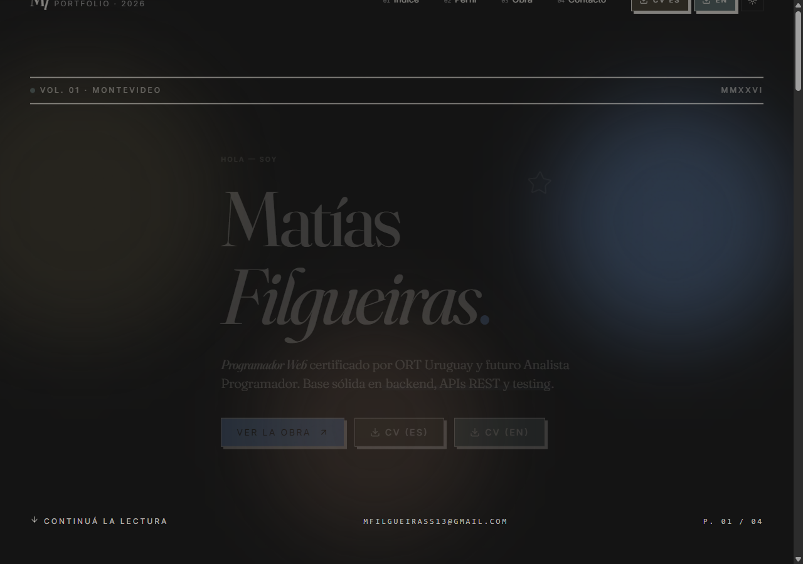

# Portfolio — Matías Filgueiras

Mi página personal: **[mqtissj.github.uy](https://mqtissj.github.uy/)**



Soy estudiante de Analista en TI en ORT (Montevideo) y acá vive el código de mi portfolio: los proyectos que fui haciendo en la facultad y por mi cuenta, mis CVs en español e inglés, y la forma de contactarme.

Lo que más tiempo me está llevando ahora es **RouteEV** ([routeev.uy](https://routeev.uy)), un planificador de rutas para autos eléctricos sobre el grafo vial real de Uruguay: 63.833 intersecciones y 97.293 tramos de OpenStreetMap, y las 259 estaciones de carga del país (211 de UTE Movilidad más 48 privadas) para insertar paradas cuando la batería no llega. Ya está en producción en beta pública — web, API y app móvil —, y en la página hay capturas y el detalle de cómo funciona.

Aparte de lo académico, cada tanto trabajo con clientes haciendo sistemas a medida — páginas, sistemas de gestión, ese tipo de cosas. El último es **PF Negocios Inmobiliarios** ([pfinmobiliaria.uy](https://pfinmobiliaria.uy)), la web y el panel de una inmobiliaria de Tacuarembó: está en producción y con mantenimiento mensual. Si te interesa algo así, escribime: los datos de contacto están en la página, o directo por [LinkedIn](https://www.linkedin.com/in/matiszn/).

## Cómo está hecho

Vite + React 18 + TypeScript, con Tailwind y shadcn/ui. El deploy sale por Vercel.

Todo el contenido (proyectos, skills, datos de contacto) vive en `landing/src/data/projects.ts` — para agregar un proyecto toco un solo archivo y listo.

## Correrlo local

```sh
cd landing
npm install
npm run dev
```

Queda andando en `http://localhost:8080`.
